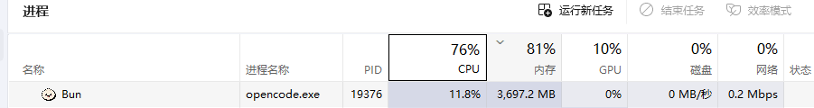
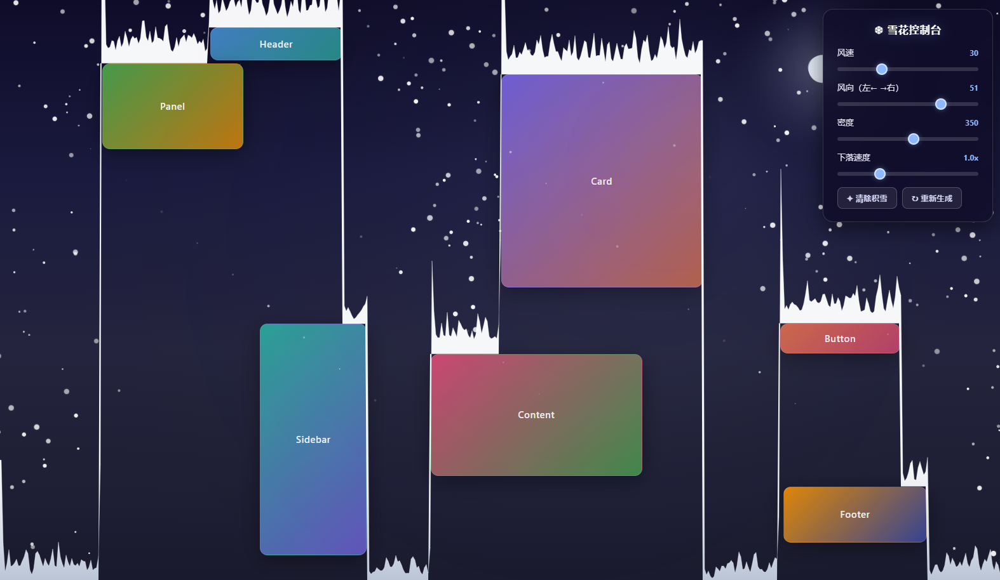
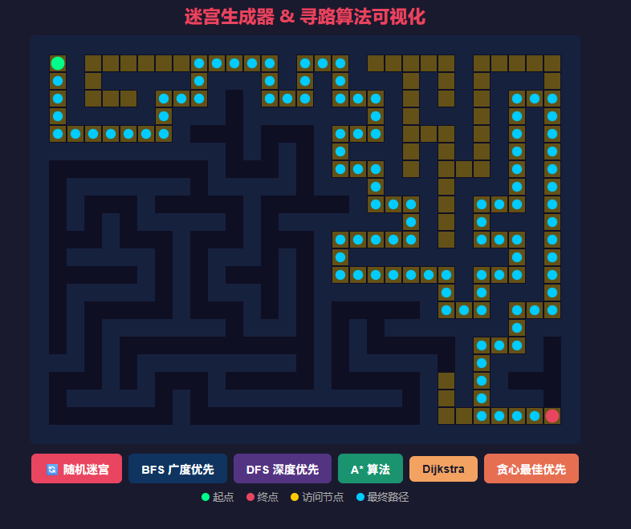
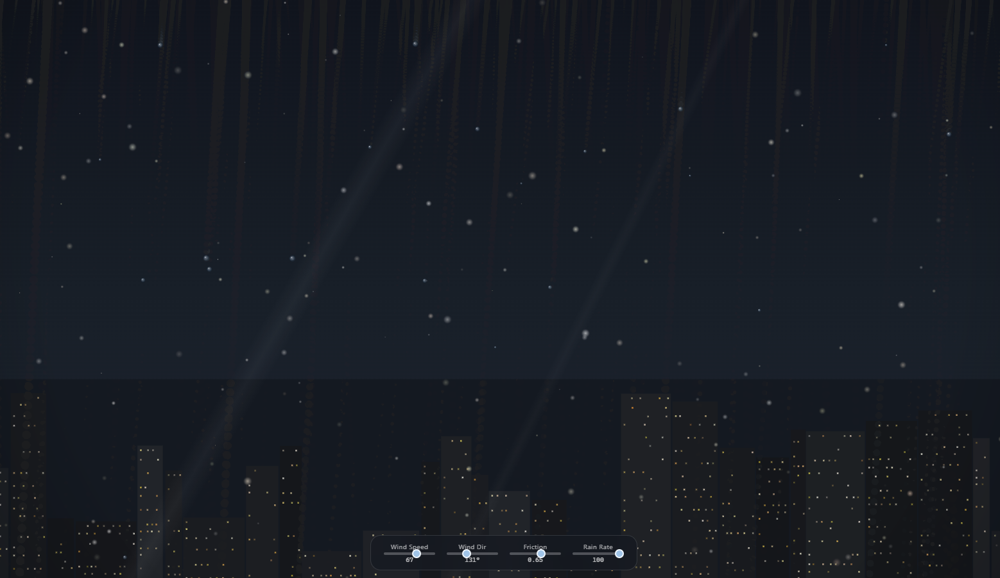
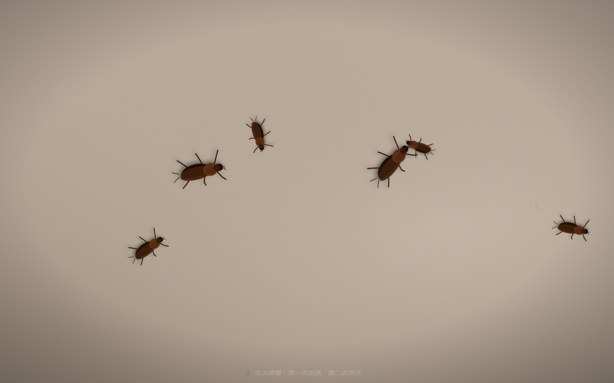
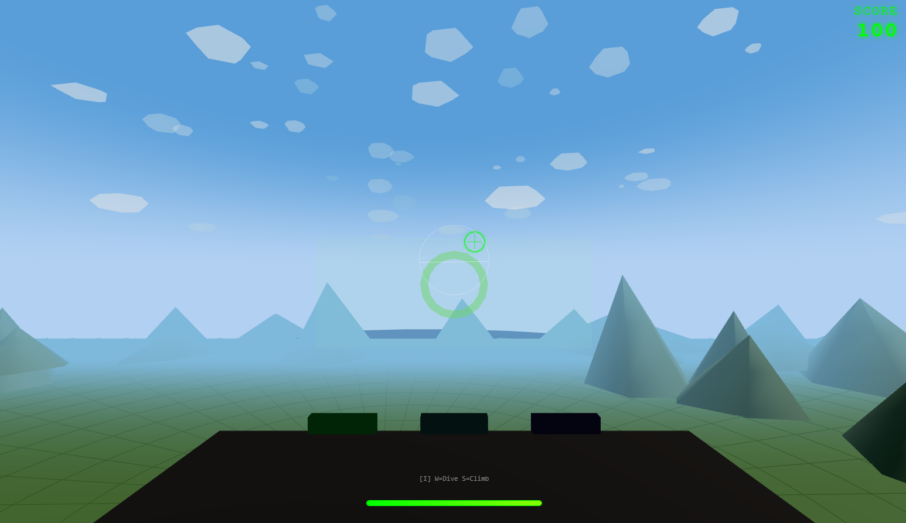
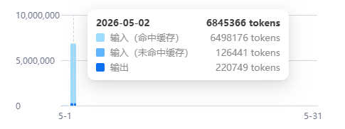
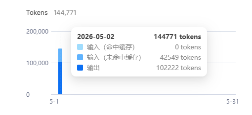
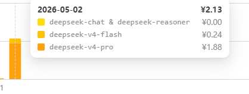

# 测试说明

使用opencode+deepseek官方API，使用high的推理等级。


内存泄露啦 第二个prompt开始换Claude code。 同时换到max的推理等级。

该测试更多图个乐，看看模型做这些题目的能力，不能真实反应模型本身水平。

# Prompts

## 雪花

```
输出一个单文件HTML。你可以引入第三方库，如TailwindCSS和必要的JS库。
帮我写一个雪花效果。随机生成一些页面元素。雪花从天空飘落。可以指定风速和风向，雪花的密度和下落速度。雪花会在页面元素和页面底部堆积。
```

测试结果：
第一次不知道为什么卡住了，思考完之后10分钟没有任务输出，重试（控制台发现输出了2w多token 应该最后成功了 被我取消了）。
第二次卡了10分钟之后开始输出文件。
emmmm..后面发现是OpenCode在那边疯狂漏内存。换成CC。

输出质量很不错，雪的堆积效果是渐进式的 但是会产生雪墙 导致会卡住掉落。


第二轮让修复下这个问题，结束之后还是没有成功。
第三轮还是没成功，放弃。

注意他本身实现的还是比之前的一些要好点。

## 迷宫生成

```
单html文件
你可以引用各类其他的库（通过CDN的形式）
完成一个迷宫生成器 有一个重置按钮可以随机产生迷宫
并且提供几种不同的寻路算法的按钮 点击对应的按钮会出现不同的圆圈执行寻路的过程
```

第一轮2分10秒完成。
完全实现需求。


## 雨滴滴落

```
做一个单文件的html 如果需要你可以引用不同的库（通过CDN的方式）
实现雨滴滴落在玻璃窗上的效果
整个屏幕是个玻璃窗  雨滴随机打落在玻璃上 然后随着重力滑下去 雨滴之间遇到会融合在一起并且提高滑动的速度 需要符合现实物理
可以调节风速 风向 玻璃表面摩擦力等因素
```

第一轮花费23分4秒完成。
实现的比较好，甚至还做了窗外的背景，效果完成的很好，但是感觉雨量不太够，让他加一点再做一轮。


## 打蟑螂

```
使用单文件的HTML
你可以通过CDN url引入一些需要的js/css类库
在屏幕上随机生成蟑螂 蟑螂会随机移动/暂停/转向
鼠标第一次点击蟑螂会加速他的移动 第二次会让他爆炸并消失
注意可以实现一些动画 比如暂停时待机动画 以及一些特效 比如灰尘 爆炸等等
```

9分56秒完成。

真的是蟑螂！！！！
但是怎么是屁股移动，而且没有完成第一次加速第二次爆炸 直接爆炸了。

让他修复了一下，2轮结束。


## 介绍网页

```
制作一个单文件的deepseek的介绍html页面 可以通过CDN引入三方的css/js库实现效果
你可以自行决定内容 但是要足够丰富
我希望你能做的现代化 使用一些特效硬造一些高级感 但不要显得很廉价
比如玻璃材质 视差效果 滚动驱动的动画等
```

emmm,又在思考阶段卡住了10分钟。然后`✻ Worked for 10m 29s`。没有任何输出，让他继续。
继续之后直接跳过了思考，开始干活:`Cerebrating… (27s · ↓ 609 tokens · thought for 1s)`。

第一轮5分1秒完成（不考虑刚刚卡住的时间）。

啊....又是紫色啊。。。。
但整体感觉还可以，背后的粒子是随着鼠标缓动的分了好几层，还挺好看。


## 驾驶舱飞行射击

```
请制作一个单文件 H5 飞行射击小游戏，所有代码尽量集中在一个 HTML 文件中，允许通过 CDN 引入必要的第三方 CSS / JS 库（例如 Three.js、音效库等），不依赖本地构建工具，页面打开即可运行。

游戏类型为驾驶舱第一人称视角的 3D 飞行射击游戏，整体操作风格参考《皇牌空战》：玩家始终以战斗机驾驶员视角进行飞行和攻击，强调高速、机动和空战压迫感。

具体要求如下：

1. 视角与画面
    - 使用 3D 场景表现天空空战。
    - 视角固定为驾驶舱第一人称视角，屏幕前方可看到简化的驾驶舱 HUD 或仪表元素，以增强沉浸感。
    - 场景中应包含天空、远景、敌机、子弹/曳光弹、爆炸等基础视觉效果。
    - 整体风格偏街机，不必追求写实，但要有速度感和战斗感。
2. 操作方式
    - 键盘操作参考空战游戏的直觉逻辑：
        - W：机头下压 / 俯冲 / 下降
        - S：机头上抬 / 拉升 / 上升
        - A：向左滚转
        - D：向右滚转
    - 鼠标用于控制准星方向，并进行机枪扫射：
        - 鼠标移动：控制机枪瞄准方向或屏幕准星偏移
        - 鼠标左键按住：持续机枪射击
    - 操作手感应尽量接近街机空战游戏，而不是无人机模拟器或写实飞行模拟器。
3. 核心玩法
    - 玩家驾驶战斗机在空中与敌机交战。
    - 敌机会在前方空域出现并进行移动，可被玩家射击击落。
    - 机枪命中敌机后应有命中特效、受击反馈和爆炸销毁效果。
    - 需要有基础得分系统，例如击落 1 架敌机加 100 分。
    - 敌机可以持续刷新，形成简单的生存或刷分玩法。
4. 交互与反馈
    - 屏幕应显示基础 HUD 信息，例如：
        - 当前分数
        - 准星
        - 射击状态
        - 可选：生命值或护盾值
    - 射击时要有明显反馈，例如枪口火光、曳光弹、击中特效、音效。
    - 被敌机撞击或命中时，可选做受损提示或屏幕闪烁效果。
5. 技术与实现要求
    - 输出为一个可直接运行的单文件 HTML。
    - 允许通过 CDN 引入 3D 渲染库和辅助库。
    - 代码结构清晰，包含初始化、输入控制、飞行更新、敌机刷新、碰撞检测、UI/HUD 更新等模块。
    - 优先保证可玩性和流畅度，不必实现复杂物理系统。
6. 最低可玩标准
    - 能进入 3D 驾驶舱视角
    - 可通过 W/S/A/D 控制飞机姿态
    - 可通过鼠标瞄准并按左键持续开火
    - 有敌机生成、被击中判定、爆炸销毁、得分累计
    - 页面加载后可直接开始游戏，不需要额外资源配置
```

第一轮16分48秒完成。
操作有点问题，翻转机身之后w和s移动不对，但是整体界面更完整，画了地面，天空和云。
第二轮修复操作问题，修复成功，现在翻转之后移动顺序就对了，还加入了WS反转功能。
但是还是有点细节小问题，比如地形会消失，飞太远了会没有地面，再修改2轮，基本能玩了。


# token消耗

Deepseek v4 Pro:


Deepseek v4 Flash:


费用:  

